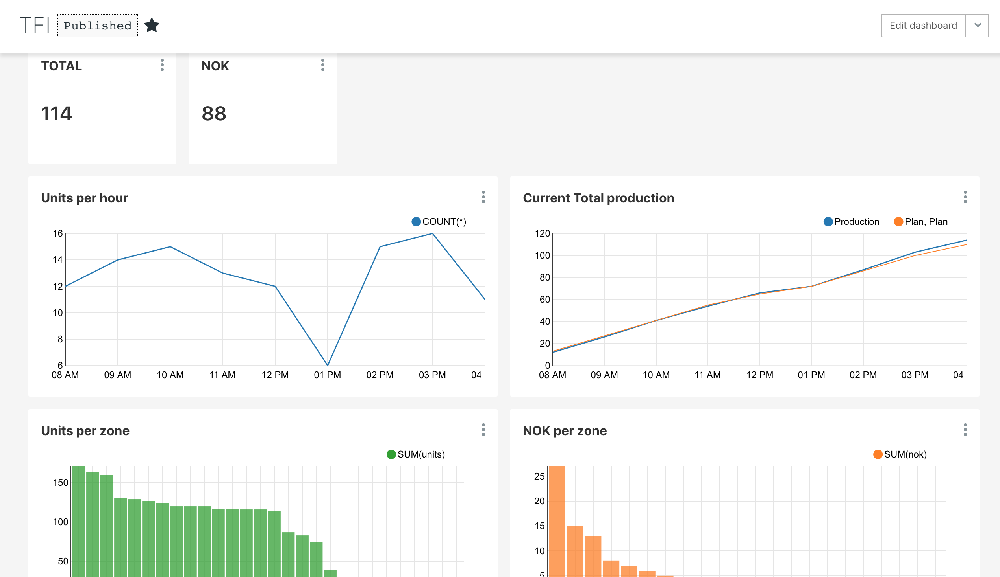
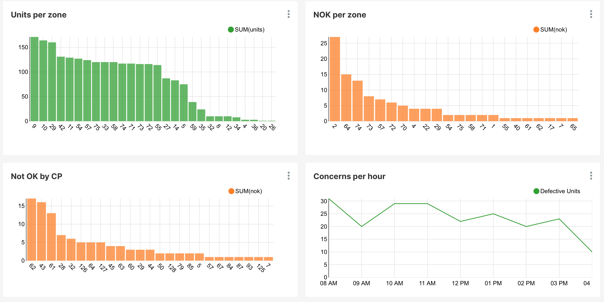

# Workshop de Big Data con Apache Spark - Entrega Seminario

## Infraestructura

Para esta entrega se  utilizará gran parte de la infraestructura demostrada en el workshop.

Mediante un script se simulará un topic de kafka corriendo en un container.
Se utilizará Spark Structured Streaming para consumir el topic y se utilizará el console sink para debug y un sink a postgres.

Se utilizará postgres como db donde se persistirán los mensajes.

Finalmente se creará un dashboard con superset donde se mostarán las métricas del negocio en tiempo real (update cada 10 segundos)

El archivo [docker-compose.yml](docker-compose.yml) contiene las definiciones y configuraciones para esos servicios y sus respectivas UIs:

* Apache Spark: [Spark Master UI](http://localhost:8080) | [Job Progress](http://localhost:4040)
* Apache Kafka
* Postgres
* [Superset](http://superset.incubator.apache.org): [Dashboard con metricas](http://localhost:8088/)

Puertos de acceso: 
* **spark master:7077**
* **postgres: 5433**
* **superset: 8088**
* **kafka: 9092**, **zookeeper: 2181**
* **jupyter: 8888**


## Levantar ambiente

Instalar el ambiente [siguiendo las instrucciones acá](INSTALL.md).

Correr el script que levanta el ambiente `Usage: control-env.sh (start|stop|cleanup)`:

```bash
./control-env.sh start

**IMPORTANTE** el script `control-env.sh cleanup` borra cualquier dado que haya sido procesado anteriormente.


# Access Spark-Master and run spark-shell
docker exec -it master bash
root@588acf96a879:/app# spark-shell
```

Acceder al [Spark Master: http://localhost:8080](http://localhost:8080) y [SPARK-UI: http://localhost:4040](http://localhost:4040).

## Correr el trabajo

Abrir una terminal y acceder al spark shell. Desde ahí correr el simulador de kafka TFI_fake_producer_kafka.py

```bash
docker exec -it master bash
root@6fbb59cf55d7:/notebook# 

cd /app/python/us-stock-analysis/src/stream/TFI/

python TFI_fake_producer_kafka.py kafka:9092 TFI
```
Esto genera un stream continuo de datos

En otro terminal acceder nuevamente al spark shell y correr el script que consume los datos y los almacena en una base de datos postgres consumer_test.py

```bash
docker exec -it master bash
root@6fbb59cf55d7:/notebook# 

cd /app/python/us-stock-analysis/

spark-submit \
  --master 'spark://master:7077' \
  --packages org.apache.spark:spark-sql-kafka-0-10_2.11:2.4.5 \
  --jars /app/postgresql-42.1.4.jar \
  src/stream/TFI/consumer_test.py \
  kafka:9092 TFI
```

Para monitorear el ingreso de datos en postgres ingresar a psql

```bash
./control-env.sh psql

psql (11.8 (Debian 11.8-1.pgdg90+1))
Type "help" for help.

workshop=#
\dt
         List of relations
  Schema  | Name | Type  |  Owner
----------+------+-------+----------
 workshop | uc   | table | workshop
 workshop | ucp  | table | workshop
(2 rows)
```

Finalmente acceder a superset siguiendo el [Instructivo](README-superset.md)

Observar el Dashboard siendo actualizado en tiempo real





## Explicación detallada de métricas

El proceso "kafka-producer" simula los mensajes que se envían a un topic de Kafka cuando se producen 2 eventos en una línea de producción: 

* Una unidad (determinada por la variable qls_unit_id) pasa por una estación de colección de datos (determinada por la variable collection_point_id) que pertenece a una "zona" de producción (determinada por la variable zone_id). Al hacerlo, se genera un mensaje utilizando la key "unit_collection_point" que contiene todos estos datos y un timestamp (unit_collection_pt_timestamp)
* Una unidad (caracterizada por qls_unit_id) tiene algún defecto (concern_id) que es ingresado en alguno de los puntos de colección (collection_point_id). Este defecto, además, es asignado a una "zona" como la causante del mismo (zone_charged_id). El mensage generado contiene toda la anterior información más un timestamp (unit_collection_pt_timestamp)

Con el procesamiento de estos mensajes es posible derivar métricas de producción tales como:
* unidades producidas por zona
* defectos por zona
* producción total diaria

También se investigó generar una métrica de "throughput". La misma consiste en calcular el % de unidades sin defectos.

Se logró para ello generar un cálculo de unidades por zona actualizado batch a batch (stateful) a consola, pero sin embargo no se pudo enviarlo de este modo a postgres, ya que el proceso de streaming a postgres es "insert" (teniendo zonas duplicadas en cada batch).
Por lo tanto, las métricas para el dashboard son calculadas directamente en superset mediante SQLLab

Los scripts se encuentran en 
```bash
code/python/us-stock-analysis/src/stream/TFI
```